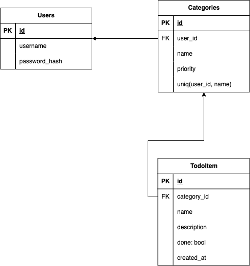

# Shared TODO

User based TODO application. Every todo item has a category. The user's main screen would be a list of
their todo items categories. Each category, when clicked, will open up a list of the items. Items can be
checked or unchecked. Each category and every item for that category is linked to the specific user. All 
routes other than `login` will be protected by a `jwt` token which will have at least the `username` as 
a claim.
Users should be able to check / uncheck or create / delete items, and create categories.

Prerequisites:
```
go install github.com/bokwoon95/wgo@latest
```


## DB structure 



### Run

```
./run
```

### Migrations

Create a new migration
```
goose create sample_migration sql
```

Migrate up
```
goose up
```


## API Calls

### POST /login

Body:

```
{
  "username": "exampleUser",
  "password": "password123"
}
```

### GET /categories

### POST /categories

Body:

```
{
  "name": "Work"
  "priority": 7
}
```

### DELETE /categories/{category_id}

### GET /categories/{category_id}/items

### POST /categories/{category_id}/items

Body: 
```
{
  "name": "Complete project report",
  "description": "description"
}
```

### PUT /items/{item_id}

Body: 
```
{
  "is_done": true
}
```

### DELETE /items/{item_id}
